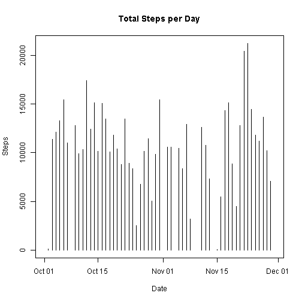
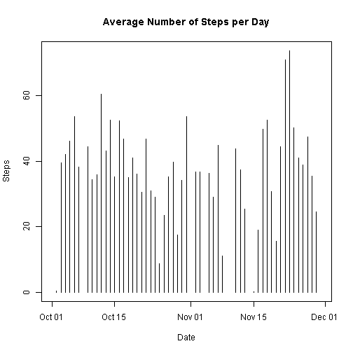
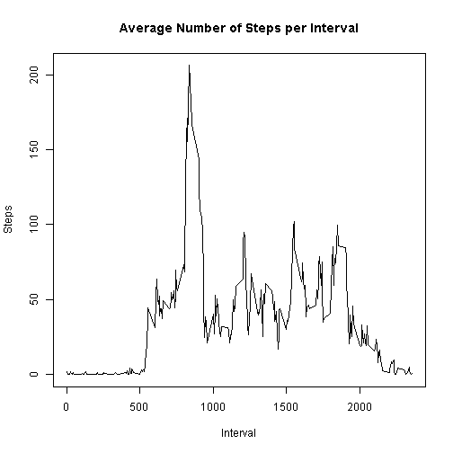
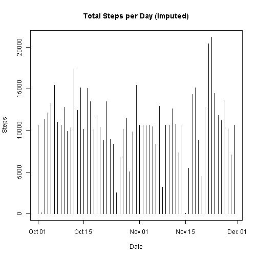
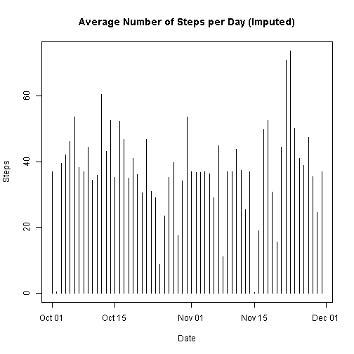
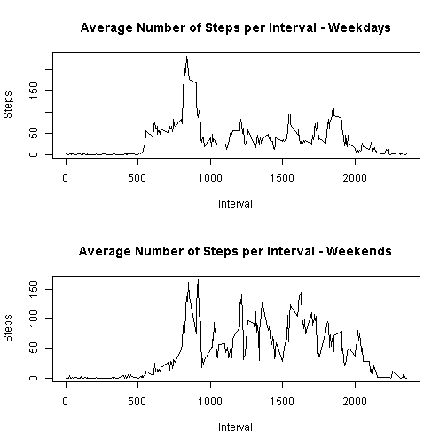

# Reproducible Research: Peer Assessment 1  


## Data 

The data for this assignment can be downloaded from the course web site:

  - Dataset [Activity monitoring data] (https://d396qusza40orc.cloudfront.net/repdata%2Fdata%2Factivity.zip) [52K]

The variables included in this dataset are

  - **steps**: Number of steps taking in a 5-minute interval (missing values are coded as NA)

  - **date**: The date on which the measurement was taken in YYYY-MM-DD format

  - **interval**: Identifier for the 5-minute interval in which measurement was taken

The dataset is stored in a comma-separated-value (CSV) file and there are a total of 17,568 observations in this dataset.


## Assignment

### Set knitr options


```r
opts_chunk$set(echo = TRUE, results = "markup", warning = FALSE, cache = TRUE, tidy = TRUE)
```

### Loading and preprocessing the data

1. Load the data (i.e. read.csv())


```r
activity <- read.csv("activity.csv")
```

2. Process/transform the data (if necessary) into a format suitable for your analysis


```r
activity$date <- as.Date(activity$date)
```

### What is mean total number of steps taken per day?

1. Make a histogram of the total number of steps taken each day


```r
sumperday <- aggregate(activity$steps, by = list(activity$date), sum)
colnames(sumperday) <- c("Date", "Steps")
plot(sumperday, type = "h", main = "Total Steps per Day")
```

 

2. Calculate and report the mean and median total number of steps taken per day


```r
meanperday <- aggregate(activity$steps, by = list(activity$date), mean)
colnames(meanperday) <- c("Date", "Steps")
plot(meanperday, type = "h", main = "Average Number of Steps per Day")
```

 

```r
medianperday <- aggregate(activity$steps, by = list(activity$date), median)
medianperday
```

```
##       Group.1  x
## 1  2012-10-01 NA
## 2  2012-10-02  0
## 3  2012-10-03  0
## 4  2012-10-04  0
## 5  2012-10-05  0
## 6  2012-10-06  0
## 7  2012-10-07  0
## 8  2012-10-08 NA
## 9  2012-10-09  0
## 10 2012-10-10  0
## 11 2012-10-11  0
## 12 2012-10-12  0
## 13 2012-10-13  0
## 14 2012-10-14  0
## 15 2012-10-15  0
## 16 2012-10-16  0
## 17 2012-10-17  0
## 18 2012-10-18  0
## 19 2012-10-19  0
## 20 2012-10-20  0
## 21 2012-10-21  0
## 22 2012-10-22  0
## 23 2012-10-23  0
## 24 2012-10-24  0
## 25 2012-10-25  0
## 26 2012-10-26  0
## 27 2012-10-27  0
## 28 2012-10-28  0
## 29 2012-10-29  0
## 30 2012-10-30  0
## 31 2012-10-31  0
## 32 2012-11-01 NA
## 33 2012-11-02  0
## 34 2012-11-03  0
## 35 2012-11-04 NA
## 36 2012-11-05  0
## 37 2012-11-06  0
## 38 2012-11-07  0
## 39 2012-11-08  0
## 40 2012-11-09 NA
## 41 2012-11-10 NA
## 42 2012-11-11  0
## 43 2012-11-12  0
## 44 2012-11-13  0
## 45 2012-11-14 NA
## 46 2012-11-15  0
## 47 2012-11-16  0
## 48 2012-11-17  0
## 49 2012-11-18  0
## 50 2012-11-19  0
## 51 2012-11-20  0
## 52 2012-11-21  0
## 53 2012-11-22  0
## 54 2012-11-23  0
## 55 2012-11-24  0
## 56 2012-11-25  0
## 57 2012-11-26  0
## 58 2012-11-27  0
## 59 2012-11-28  0
## 60 2012-11-29  0
## 61 2012-11-30 NA
```

### What is the average daily activity pattern?

1. Make a time series plot (i.e. type = "l") of the 5-minute interval (x-axis) and the average number of steps taken, averaged across all days (y-axis)


```r
meanperint <- aggregate(activity$steps, by = list(activity$interval), mean, 
    na.rm = TRUE)
colnames(meanperint) <- c("Interval", "Steps")
plot(meanperint, type = "l", main = "Average Number of Steps per Interval")
```

 

2. Which 5-minute interval, on average across all the days in the dataset, contains the maximum number of steps?


```r
maxsteps <- max(meanperint$Steps)
meanperint[meanperint$Steps == maxsteps, ]
```

```
##     Interval    Steps
## 104      835 206.1698
```
*The 5-minute interval that contains the most number of steps is Interval#* **835**

### Imputing missing values

1. Calculate and report the total number of missing values in the dataset (i.e. the total number of rows with NAs)


```r
sum(is.na(activity$steps))
```

```
## [1] 2304
```
*The total number of missing values is* **2,304**

2. Devise a strategy for filling in all of the missing values in the dataset. The strategy does not need to be sophisticated. For example, you could use the mean/median for that day, or the mean for that 5-minute interval, etc.  

*The strategy will be to use the average (across all days) of steps for that interval as the imputed value.* 

3. Create a new dataset that is equal to the original dataset but with the missing data filled in.


```r
actfill <- activity

for (i in 1:nrow(actfill)) {
    if (is.na(actfill[i, "steps"])) 
        actfill[i, "steps"] <- as.integer(meanperint$Steps[meanperint$Interval == 
            actfill[i, "interval"]])
}
```

4. Make a histogram of the total number of steps taken each day and Calculate and report the mean and median total number of steps taken per day. 


```r
sumperday2 <- aggregate(actfill$steps, by = list(actfill$date), sum)
colnames(sumperday2) <- c("Date", "Steps")
plot(sumperday2, type = "h", main = "Total Steps per Day (Imputed)")
```

 


```r
meanperday2 <- aggregate(actfill$steps, by = list(actfill$date), mean)
colnames(meanperday2) <- c("Date", "Steps")
plot(meanperday2, type = "h", main = "Average Number of Steps per Day (Imputed)")
```

 


```r
medianperday2 <- aggregate(actfill$steps, by = list(actfill$date), median)
colnames(medianperday2) <- c("Date", "Steps")
# plot(medianperday2, type = 'h', main = 'Median Number of Steps per Day
# (Imputed)')
medianperday2
```

```
##          Date Steps
## 1  2012-10-01  33.5
## 2  2012-10-02   0.0
## 3  2012-10-03   0.0
## 4  2012-10-04   0.0
## 5  2012-10-05   0.0
## 6  2012-10-06   0.0
## 7  2012-10-07   0.0
## 8  2012-10-08  33.5
## 9  2012-10-09   0.0
## 10 2012-10-10   0.0
## 11 2012-10-11   0.0
## 12 2012-10-12   0.0
## 13 2012-10-13   0.0
## 14 2012-10-14   0.0
## 15 2012-10-15   0.0
## 16 2012-10-16   0.0
## 17 2012-10-17   0.0
## 18 2012-10-18   0.0
## 19 2012-10-19   0.0
## 20 2012-10-20   0.0
## 21 2012-10-21   0.0
## 22 2012-10-22   0.0
## 23 2012-10-23   0.0
## 24 2012-10-24   0.0
## 25 2012-10-25   0.0
## 26 2012-10-26   0.0
## 27 2012-10-27   0.0
## 28 2012-10-28   0.0
## 29 2012-10-29   0.0
## 30 2012-10-30   0.0
## 31 2012-10-31   0.0
## 32 2012-11-01  33.5
## 33 2012-11-02   0.0
## 34 2012-11-03   0.0
## 35 2012-11-04  33.5
## 36 2012-11-05   0.0
## 37 2012-11-06   0.0
## 38 2012-11-07   0.0
## 39 2012-11-08   0.0
## 40 2012-11-09  33.5
## 41 2012-11-10  33.5
## 42 2012-11-11   0.0
## 43 2012-11-12   0.0
## 44 2012-11-13   0.0
## 45 2012-11-14  33.5
## 46 2012-11-15   0.0
## 47 2012-11-16   0.0
## 48 2012-11-17   0.0
## 49 2012-11-18   0.0
## 50 2012-11-19   0.0
## 51 2012-11-20   0.0
## 52 2012-11-21   0.0
## 53 2012-11-22   0.0
## 54 2012-11-23   0.0
## 55 2012-11-24   0.0
## 56 2012-11-25   0.0
## 57 2012-11-26   0.0
## 58 2012-11-27   0.0
## 59 2012-11-28   0.0
## 60 2012-11-29   0.0
## 61 2012-11-30  33.5
```

Do these values differ from the estimates from the first part of the assignment?  
*Yes.*

What is the impact of imputing missing data on the estimates of the total daily number of steps?  
*The plots are smoother due to the imputed NA values.*

### Are there differences in activity patterns between weekdays and weekends?

For this part the weekdays() function may be of some help here. Use the dataset with the filled-in missing values for this part.

1. Create a new factor variable in the dataset with two levels – “weekday” and “weekend” indicating whether a given date is a weekday or weekend day.


```r
daytype <- character()

for (i in 1:nrow(actfill)) {
    if (weekdays(actfill[i, "date"]) %in% c("Saturday", "Sunday")) {
        daytype <- c(daytype, "Weekend")
    } else {
        daytype <- c(daytype, "Weekday")
    }
}

actday <- cbind(actfill, daytype)
```

2. Make a panel plot containing a time series plot (i.e. type = "l") of the 5-minute interval (x-axis) and the average number of steps taken, averaged across all weekday days or weekend days (y-axis). 
#  See the README file in the GitHub repository to see an example of what this plot should look like using simulated data.


```r
actweekdays <- actday[daytype == "Weekday", ]
weekdaymean <- aggregate(actweekdays$steps, by = list(actweekdays$interval), 
    mean, na.rm = TRUE)
colnames(weekdaymean) <- c("Interval", "Steps")

actweekends <- actday[daytype == "Weekend", ]
weekendmean <- aggregate(actweekends$steps, by = list(actweekends$interval), 
    mean, na.rm = TRUE)
colnames(weekendmean) <- c("Interval", "Steps")

par(mfrow = c(2, 1))
plot(weekdaymean, type = "l", main = "Average Number of Steps per Interval - Weekdays")
plot(weekendmean, type = "l", main = "Average Number of Steps per Interval - Weekends")
```

 

*Yes, there are differences in activity patterns between weekdays and weekends.*
